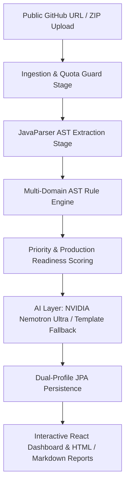

# Codexa 🛡️
> **AI-Assisted Code Review, Static Security Auditing & Production-Readiness Platform**

[](https://www.oracle.com/java/)
[](https://spring.io/projects/spring-boot)
[](https://vitejs.dev/)
[](https://tailwindcss.com/)
[](LICENSE)
[]()

---

## 📌 Product Vision
The rapid adoption of AI coding assistants (GitHub Copilot, Cursor, Claude Code, etc.) has enabled high-velocity "vibe-coding" — codebases generated quickly that appear functional on the surface but often contain subtle OWASP Top 10 vulnerabilities, severe architectural debt, missing access controls, hardcoded secrets, and zero operational hardening.

**Codexa** answers the vital question: **"Can this code safely move toward production?"**

Users submit codebases via **ZIP archive** or a **public GitHub repository URL**. Codexa safely stages the untrusted code, executes deterministic Abstract Syntax Tree (AST) static analysis, prioritizes issues with an explainable formula ($P = W_s \times W_c \times W_e \times W_i$), computes an explainable **Production Readiness Score (0–100)**, generates plain-English remediation guidance with copyable before/after code diffs powered by **NVIDIA Nemotron Ultra** (with offline deterministic fallback), and produces downloadable audit reports.

> **⚠️ Advisory Disclaimer**: Codexa is an advisory static analysis and education platform, not a formal security certification. A clean scan does not guarantee the absence of all vulnerabilities. Suggested remediations must undergo human review and automated testing before production deployment.

---

## 🏗️ Architecture & Pipeline Overview

Codexa processes untrusted codebases through a multi-stage sequential pipeline with zero code execution and deterministic fallback guarantees:



### Key Architectural Tenets:
1. **Strict Zero Code Execution**: User-submitted code is never compiled, never dynamically executed, and never loaded into runtime classloaders. Analysis is 100% lexical and AST-based via JavaParser 3.26+.
2. **Multi-Layer Ingestion Defense**:
   - **Zip Slip Defense**: Enforces canonical destination validation within isolated UUID staging directories.
   - **Zip Bomb Defenses**: Hard quotas on file count (1000), directory depth (15), single file size (5MB), and total expanded size (100MB).
   - **SSRF Prevention**: HTTPS-only transport, strict host whitelisting (`github.com`, `api.github.com`), redirect limits, and internal RFC 1918 / localhost / cloud metadata (169.254.169.254) blocking.
   - **DoS Rate Limiting**: In-memory token bucket sliding window per client IP address.
   - **OWASP Security Response Headers**: Content-Security-Policy, X-Content-Type-Options: nosniff, X-Frame-Options: DENY, Referrer-Policy: strict-origin-when-cross-origin.
3. **Secret Redaction by Design**: Real tokens (AWS keys, GitHub tokens, OpenAI keys, JWTs, DB passwords) are masked in-flight before storage, display, or prompt transmission to LLMs.
4. **AI Layer with NVIDIA Nemotron Ultra**: Supports `nvidia/llama-3.1-nemotron-70b-instruct` via NVIDIA NIM OpenAI-compatible API (`https://integrate.api.nvidia.com/v1/chat/completions`) with SHA-256 caching and offline deterministic rule templates.

---

## 📐 Scoring Formula & Readiness Verdicts

### Issue Priority Score ($P$)
Every detected finding receives an explainable priority score:
$$\text{Priority Score } (P) = W_{\text{severity}} \times W_{\text{confidence}} \times W_{\text{exploitability}} \times W_{\text{impact}}$$

* **Severity Weights ($W_s$)**: `CRITICAL: 1.0`, `HIGH: 0.8`, `MEDIUM: 0.5`, `LOW: 0.2`
* **Confidence Weights ($W_c$)**: `CONFIRMED: 1.0`, `HIGH: 0.8`, `MEDIUM: 0.6`, `SUSPECTED: 0.4`
* **Exploitability ($W_e$)**: Scaled $0.1 - 1.0$ based on user input reachability.
* **Impact ($W_i$)**: Scaled $0.1 - 1.0$ based on blast radius (RCE/data exfiltration vs stylistic).

### Production Readiness Score (0–100)
$$\text{Readiness Score} = (\text{Security} \times 0.60) + (\text{Quality} \times 0.25) + (\text{Operations} \times 0.15)$$

### Hard Verdict Overrides:
* Any **CRITICAL** finding $\implies$ Verdict capped at **`NOT_READY`** (Score $\le 40$).
* Any **HIGH** finding $\implies$ Verdict capped at **`NEEDS_URGENT_FIXES`** (Score $\le 65$).
* Clean scans $\implies$ **`REVIEW_COMPLETE`** ($80 - 100$).

---

## 🛡️ Static Rule Catalog (18 Rules)

| Rule ID | Name | Category | Severity | OWASP Top 10 |
| :--- | :--- | :--- | :--- | :--- |
| `CR-SQL-001` | SQL Injection Detection | SECURITY | CRITICAL | A03:2021-Injection |
| `CR-CMD-001` | Command Injection Detection | SECURITY | CRITICAL | A03:2021-Injection |
| `CR-SEC-001` | Hardcoded Secrets Detection | SECURITY | HIGH | A07:2021-Identification and Auth Failures |
| `CR-AUTH-001`| Missing Access Control | SECURITY | HIGH | A01:2021-Broken Access Control |
| `CR-XSS-001` | Reflected Cross-Site Scripting | SECURITY | HIGH | A03:2021-Injection |
| `CR-PASS-001`| Weak Password Hashing (MD5/SHA-1) | SECURITY | HIGH | A02:2021-Cryptographic Failures |
| `CR-CRYPTO-001`| Weak Cryptography (ECB / Insecure PRNG) | SECURITY | MEDIUM | A02:2021-Cryptographic Failures |
| `CR-LOG-001` | Sensitive Data Logging | SECURITY | MEDIUM | A09:2021-Security Logging & Monitoring |
| `CR-CONFIG-001`| Insecure CORS / Permissive Config | SECURITY | MEDIUM | A05:2021-Security Misconfiguration |
| `CR-DEP-001` | Supply Chain & Outdated Dependency Risk | SECURITY | MEDIUM | A06:2021-Vulnerable & Outdated Components |
| `CR-QUAL-001`| High Cyclomatic Complexity ($CC > 15$) | QUALITY | MEDIUM | Maintainability |
| `CR-QUAL-002`| Long Method Smell ($> 50$ lines) | QUALITY | LOW | Clean Architecture |
| `CR-QUAL-003`| Deep Block Nesting ($> 4$ levels) | QUALITY | LOW | Code Readability |
| `CR-QUAL-004`| Duplicate Logic / Copy-Paste Blocks | QUALITY | LOW | DRY Principle |
| `CR-QUAL-005`| Direct Controller Persistence Access | QUALITY | MEDIUM | Layered Architecture |
| `CR-QUAL-006`| Swallowed / Broad Exception Handling | QUALITY | MEDIUM | Robust Error Handling |
| `CR-OPS-002` | Unstructured / Missing Request Logging | OPERATIONS | LOW | Observability |
| `CR-OPS-004` | Missing Input Validation on `@RequestBody` | OPERATIONS | MEDIUM | Defensive Coding |

---

## 🚀 Quick Start Guide

### Prerequisites
- **JDK 17 or higher** (JDK 17, 21, 26 tested)
- **Apache Maven 3.9+**
- **Node.js 18+** & **npm**

### 1. Clone & Configure
```bash
git clone https://github.com/Codewithjainam7/Codexa.git
cd Codexa

# Copy environment template
cp .env.example .env
```
*(Optional: set `NVIDIA_API_KEY=nvapi-...` in `.env` to enable live NVIDIA Nemotron Ultra LLM explanations)*

### 2. Launch Backend (Spring Boot)
```bash
cd backend
mvn spring-boot:run
```
* **REST API**: `http://localhost:8080`
* **Swagger UI / OpenAPI Documentation**: `http://localhost:8080/swagger-ui.html`
* **Health Check**: `http://localhost:8080/api/v1/health`

### 3. Launch Frontend (React + Vite)
```bash
cd frontend
npm install
npm run dev
```
* **Interactive Dashboard**: `http://localhost:5173`

---

## 📦 Test Fixtures & Demonstrations

Codexa provides 3 realistic reference fixtures in the `fixtures/` directory:

1. **`fixtures/codexa-demo-vulnerable`**:
   - Contains intentional SQL Injection, Command Injection, hardcoded JWT secrets, weak MD5 hashing, unauthenticated admin controllers, sensitive logging, and ECB ciphers.
   - Scored: `0.0 / 100` (`NOT_READY`).
2. **`fixtures/codexa-demo-secure`**:
   - Clean, production-hardened counterpart using `PreparedStatement`, `BCryptPasswordEncoder`, `@PreAuthorize("hasRole('ADMIN')")`, AES/GCM ciphers, and validation annotations.
   - Scored: `100.0 / 100` (`REVIEW_COMPLETE`).
3. **`fixtures/codexa-demo-ambiguous`**:
   - Demonstrates borderline patterns requiring human review (e.g., custom SQL sanitizers, controller-level header tokens).

---

## 📡 REST API Reference

| Method | Endpoint | Description |
| :--- | :--- | :--- |
| `POST` | `/api/v1/analyses/zip` | Upload multipart ZIP codebase for sandboxed audit (`202 Accepted`) |
| `POST` | `/api/v1/analyses/github` | Submit public GitHub repository URL (`202 Accepted`) |
| `GET` | `/api/v1/analyses/{jobId}` | Query analysis status, stage progress, category metrics, and score |
| `GET` | `/api/v1/analyses/{jobId}/findings` | Paginated & filterable list of findings (`?category=&severity=&search=`) |
| `GET` | `/api/v1/analyses/{jobId}/report` | Export audit report (`?format=json`, `?format=html`, `?format=markdown`) |
| `GET` | `/api/v1/health` | Service health status |
| `GET` | `/api/v1/config/limits` | Active upload & staging quota limits |

---

## 🧪 Automated Verification & Test Suite

Codexa includes **60 automated tests** covering unit rules, integration flows, SSRF defenses, and rate limiting:

```bash
cd backend
mvn test
```

Test coverage includes:
- **Zip Slip & Bomb Prevention**: Tests directory traversal attempts and maximum expansion bounds.
- **SSRF Hardening**: Verifies rejection of private IPs, localhost, cloud metadata endpoints, and non-HTTPS URLs.
- **Secret Masking**: Validates that credentials never leak into logs, prompts, or reports.
- **DoS Rate Limiting**: Tests token bucket limits on submission endpoints.
- **End-to-End Pipeline**: Full test runs against `codexa-demo-vulnerable`.

---

## 📊 Milestone Roadmap Completion

- [x] **Milestone 1: Foundation** — Spring Boot 3.3.3, JPA dual-profile, OpenAPI Swagger UI, Health & Limit endpoints.
- [x] **Milestone 2: Secure ZIP Ingestion** — Zip Slip canonical validation, bomb quotas, path depth limits, ephemeral UUID sandbox.
- [x] **Milestone 3: Java AST Analysis Engine** — JavaParser 3.26+ syntax visitor, line mapping, source snippet extractors.
- [x] **Milestone 4: Core Rule Engine** — 18 deterministic AST rules across Security, Code Quality, and Operations.
- [x] **Milestone 5: Scoring & Prioritization Engine** — Explainable Priority Formula ($P$) & Production Readiness Score ($0-100$).
- [x] **Milestone 6: Public GitHub Ingestion** — Safe HTTPS archive streaming with strict SSRF defenses.
- [x] **Milestone 7: AI Explanation Layer (NVIDIA Nemotron Ultra)** — Secret masking, JSON schema enforcement, SHA-256 caching, and deterministic fallback templates.
- [x] **Milestone 8: UI Dashboard & Fix Diffs** — Interactive React dashboard, live search/filter bar, before/after diff viewer with copyable fixes.
- [x] **Milestone 9: Security Hardening & Edge Cases** — OWASP security headers, DoS rate limiting filter, and comprehensive test suite.
- [x] **Milestone 10: Multi-Format Report Export & Release Packaging** — Downloadable HTML, Markdown, and JSON audit reports, demo fixtures, and documentation.

---

## 🔒 Security & Privacy Notice
Codexa treats all submitted codebases as untrusted and private. Uploaded archives and cloned repositories are isolated in ephemeral UUID directories and purged immediately upon analysis completion or via automated scheduled sweeps. No source code or credentials are transmitted externally without explicit user configuration.
