# Codexa 🛡️
> **AI-Assisted Code Review, Security Auditing & Production-Readiness Platform**

[](https://www.oracle.com/java/)
[](https://spring.io/projects/spring-boot)
[](https://vitejs.dev/)
[](https://tailwindcss.com/)
[](LICENSE)

---

## 📌 Product Vision
The rapid rise of AI coding assistants (GitHub Copilot, Cursor, etc.) has led to widespread "vibe-coding" — codebases generated rapidly that function on the surface but harbor subtle OWASP security risks, severe maintainability debt, and zero operational hardening.

**Codexa** answers the core question: **"Can this code safely move toward production?"**

Users submit code via **ZIP archive** or a **public GitHub repository**. Codexa securely stages the untrusted code, executes deterministic Abstract Syntax Tree (AST) static analysis, prioritizes issues with explainable math, computes a transparent **Production Readiness Score (0–100)**, and produces plain-English remediation guidance and before/after code diffs.

> **⚠️ Advisory Disclaimer**: Codexa is an advisory static analysis platform, not a guarantee of security or compliance certification. A clean scan does not prove the total absence of vulnerabilities, and suggested remediations must always undergo human review and testing before production deployment.

---

## 🏗️ Architecture & Technology Stack

```mermaid
flowchart LR
    A[ZIP Upload / GitHub URL] --> B[Secure Staging & Quota Manager]
    B --> C[File Filter & Sanitizer]
    C --> D[JavaParser AST Static Engine]
    D --> E[Multi-Domain Rule Evaluator]
    E --> F[Explainable Prioritizer]
    F --> G[Production Readiness Scoring Engine]
    G --> H[Optional AI Explainer & Secret Masker]
    H --> I[Spring Data JPA Persistence]
    I --> J[Interactive React Dashboard & Reports]
```



- **Backend**: Java 17+, Spring Boot 3.3.3, Maven, Spring Data JPA (H2 in-memory / PostgreSQL).
- **Static Analysis**: JavaParser 3.26+ for zero-execution AST syntax and data-flow pattern matching.
- **Frontend**: React 18, Vite 5, Tailwind CSS, Lucide Icons.
- **Security Posture**:
  - **Zero Execution**: Untrusted code is never compiled, executed, or loaded into JVM classloaders.
  - **Zip Slip Defense**: Canonical path validation strictly enforces extraction within dedicated UUID staging directories.
  - **Zip Bomb Defenses**: Quotas on file count (1000), directory depth (15), single file size (5MB), and total expanded size (100MB).
  - **SSRF Prevention**: Strict HTTPS validation restricted to github.com with private IP routing blocks.

---

## 🚀 Getting Started

### Prerequisites
- **JDK 17 or higher** (JDK 17, 21, 26 supported)
- **Apache Maven 3.9+**
- **Node.js 18+** & **npm**

### 1. Clone & Configure Environment
```bash
git clone https://github.com/Codewithjainam7/Codexa.git
cd Codexa

# Copy environment variables
cp .env.example .env
```

### 2. Run Backend (Spring Boot)
```bash
cd backend
mvn clean spring-boot:run
```
* Backend starts at `http://localhost:8080`
* Swagger / OpenAPI UI: `http://localhost:8080/swagger-ui.html`
* Health Check: `http://localhost:8080/api/v1/health`

### 3. Run Frontend (React + Vite)
```bash
cd frontend
npm install
npm run dev
```
* Frontend starts at `http://localhost:5173`

---

## 📡 REST API Reference

| Method | Endpoint | Description |
| :--- | :--- | :--- |
| `POST` | `/api/v1/analyses/zip` | Upload multipart ZIP codebase for sandboxed audit (`202 Accepted`) |
| `POST` | `/api/v1/analyses/github` | Submit public GitHub repository URL (`202 Accepted`) |
| `GET` | `/api/v1/analyses/{jobId}` | Query analysis status, progress, category metrics, and score |
| `GET` | `/api/v1/analyses/{jobId}/findings` | Paginated & filterable list of detected findings |
| `GET` | `/api/v1/analyses/{jobId}/report` | Export self-contained audit report (`?format=json` or `?format=html`) |
| `GET` | `/api/v1/health` | Service health status |
| `GET` | `/api/v1/config/limits` | Active upload & extraction limits |

---

## 🧪 Testing

Execute backend test suites (including Zip Slip exploit tests, bomb limit validations, and integration flows):
```bash
cd backend
mvn test
```

Execute frontend production build test:
```bash
cd frontend
npm run build
```

---

## 📊 Delivery Milestones

- [x] **Milestone 1: Foundation** — Spring Boot 3.x, JPA dual-profile, OpenAPI, React Vite frontend scaffold, Health endpoints, Git remote.
- [x] **Milestone 2: Secure ZIP Ingestion** — Zip Slip prevention, bomb quotas, path depth limits, staging lifecycle, file filtering.
- [ ] **Milestone 3: JavaParser AST Analysis** — AST visitor engine, line mapping, source snippet extractors.
- [ ] **Milestone 4: Core Rule Engine** — Security (SQLi, Command injection, Hardcoded secrets, Weak crypto, etc.) & Quality rules.
- [ ] **Milestone 5: Scoring & Prioritization** — 0–100 Production Readiness Score with category weights and critical caps.
- [ ] **Milestone 6: Public GitHub Ingestion** — Safe archive fetching with SSRF protection.
- [ ] **Milestone 7: AI Explanation Layer** — Secret masking, structured JSON schema, fallback templates, and SHA-256 caching.
- [ ] **Milestone 8: Dashboard & Fix Diffs** — Interactive finding filters, before/after diff viewer with copyable fixes.
- [ ] **Milestone 9: Hardening & Verification** — Rate limiting, security headers, comprehensive security test suite.
- [ ] **Milestone 10: Demo Fixtures & Final Packaging** — `codexa-demo-vulnerable`, `codexa-demo-secure`, final documentation.

---

## 🔒 Security & Privacy Notice
Codexa treats all submitted codebases as untrusted and private. Uploaded archives are stored in ephemeral UUID directories and purged immediately upon analysis completion or via automated scheduled sweeps. No telemetry or source code is transmitted externally unless explicitly enabled by the user in the AI configuration.
