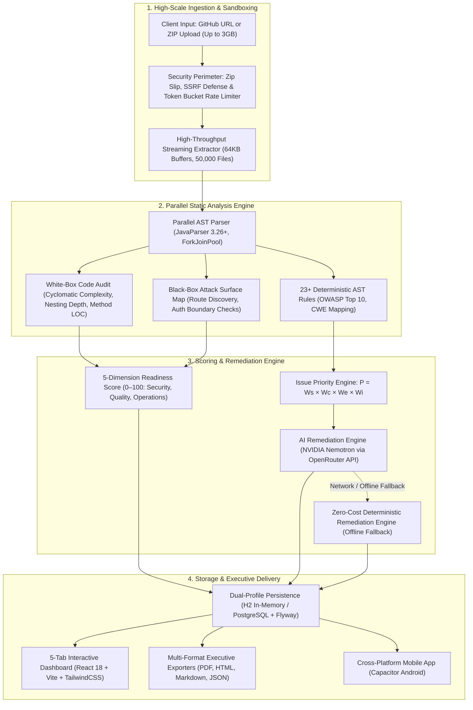

# Codexa 🛡️
> **AI-Assisted Code Review, Static Security Auditing & Production-Readiness Platform**

[](https://www.oracle.com/java/)
[](https://spring.io/projects/spring-boot)
[](https://vitejs.dev/)
[](https://tailwindcss.com/)
[](LICENSE)
[-emerald.svg)]()
[]()
[](https://owasp.org/www-project-top-ten/)
[](Dockerfile)

---

## 📌 1. Product Vision & Problem Statement

The emergence of AI coding assistants (GitHub Copilot, Cursor, Claude Code, ChatGPT) has catalyzed high-velocity **"vibe-coding"** — software constructed rapidly from prompt iterations. While vibe-coded software frequently appears syntactically clean and functional on the surface, empirical security audits reveal that it often harbors critical latent risks:
- Subtle **OWASP Top 10 vulnerabilities** (SQL Injection, Command Injection, Insecure Deserialization, SSRF, Path Traversal).
- **Missing access control gates** on exposed controller endpoints.
- **Leaked secrets**, API tokens, and hardcoded private keys.
- **Architectural debt**: runaway cyclomatic complexity, deeply nested control flows, layer bleeding, and unhandled edge-case exceptions.
- **Zero operational hardening**: unvalidated inputs, permissive CORS configurations, and insecure defaults.

### What Codexa Does
**Codexa** answers the vital engineering and executive question: **"Can this code safely move toward production?"**

Codexa functions as an autonomous, pre-deployment static security, structural quality, and operational readiness gatekeeper. Users submit untrusted repositories via **ZIP archive (up to 3.0 GB / 50,000 files)** or a **public GitHub repository URL**. Codexa safely stages the code in an isolated sandbox, executes high-throughput parallel AST static analysis with zero dynamic code execution, collects deep **White-Box AST structural complexity** and **Black-Box API attack surface mappings**, calculates an explainable **Production Readiness Score (0–100)** across 5 dimensions, enriches critical findings with AI-assisted remediation diffs, and provides an interactive 5-tab dashboard alongside executive audit reports in **PDF, HTML, Markdown, and JSON**.

> **⚠️ Advisory Disclaimer**: Codexa is an advisory static analysis, educational audit, and pre-deployment gatekeeper platform. It is not a formal legal security certification. A clean scan does not guarantee the absence of all vulnerabilities or zero-day exploits. All automated remediations and code patches must undergo human peer review and regression testing prior to production rollout.

---

## 🏗️ 2. High-Level Architecture & Analysis Pipeline

Codexa executes a multi-stage deterministic analysis pipeline engineered for maximum throughput, zero code execution, and defensive isolation:



### Key Architectural Tenets

| Tenet | Technical Implementation |
| :--- | :--- |
| **Strict Zero Code Execution** | Target code is never compiled, never interpreted, never executed in a JVM runtime classloader, and never invoked in sub-processes. Analysis is strictly lexical and AST-based. |
| **High-Throughput Parallel AST** | AST construction utilizes a managed `ForkJoinPool` with `ThreadLocal<JavaParser>` instances, eliminating lock contention and parser re-allocation overhead across worker threads. |
| **High-Scale Ingestion Boundaries** | Accommodates enterprise repositories up to **3,072 MB (3.0 GB)** upload size, **3,500 MB** request payload, **4,000 MB** extracted disk quota, and **50,000 files** per scan with a 30-minute processing timeout. |
| **Defense-in-Depth Isolation** | All archives are extracted into unique UUID-isolated staging paths (`.staging/<uuid>`) and rigorously purged upon analysis completion. |
| **Deterministic Fallback Routing** | The analysis pipeline functions with 100% fidelity even when completely disconnected from the Internet or third-party AI APIs via the built-in deterministic remediation engine. |

---

## 🔬 3. Dual-Spectrum Inspection Engine

Codexa bridges the traditional divide between internal source code static analysis and external black-box dynamic surface mapping through its **Dual-Spectrum Inspection Engine**:

```
                              ┌────────────────────────────────────────────────────────┐
                              │           Codexa Dual-Spectrum Inspection              │
                              └───────────────────────────┬────────────────────────────┘
                                                          │
                    ┌─────────────────────────────────────┴─────────────────────────────────────┐
                    ▼                                                                           ▼
┌───────────────────────────────────────┐                                   ┌───────────────────────────────────────┐
│     White-Box AST Code Audit          │                                   │    Black-Box Attack Surface Scanner   │
├───────────────────────────────────────┤                                   ├───────────────────────────────────────┤
│ • McCabe Cyclomatic Complexity        │                                   │ • Automated HTTP Route Discovery      │
│ • Maximum Control-Flow Nesting Depth  │                                   │ • Ingress Parameter & Body Extraction │
│ • Method & Class Line Length Metrics  │                                   │ • Access Control Boundary Check       │
│ • Structural Tally (Classes/Methods)  │                                   │ • Route Risk Rating (High/Med/Low)    │
│ • Top Complex Files Leaderboard       │                                   │ • Perimeter Defense Posture Check     │
└───────────────────────────────────────┘                                   └───────────────────────────────────────┘
```

### A. White-Box AST Code Audit (Internal Structural Integrity)
The white-box collector traverses parsed Abstract Syntax Trees to measure architectural health and maintainability:
- **Cyclomatic Complexity (McCabe Metric)**: Computes decision points ($M = E - N + 2P$) for every method, identifying branching bottlenecks and hard-to-test code paths ($CC > 15$ flagged).
- **Maximum Nesting Depth**: Analyzes AST block indentation hierarchy to detect deep control flow nesting ($> 4$ levels) and the "arrow anti-pattern".
- **Method & Class Dimensions**: Flags bloated monolithic methods ($> 50$ lines) and God-classes.
- **Structural Inventory**: Tallies total classes, interfaces, methods, fields, executable LOC, comment LOC, and blank lines.
- **Top Complex Files Leaderboard**: Ranks the top 10 most complex files across the project with immediate refactoring recommendations.

### B. Black-Box Attack Surface Simulation (External Perimeter Vulnerability)
Simulates an external penetration tester mapping out the application's attack surface without running the app:
- **Route Discovery**: Identifies all exposed HTTP endpoints declared across controllers (`@GetMapping`, `@PostMapping`, `@PutMapping`, `@DeleteMapping`, `@PatchMapping`, `@RequestMapping`, Express routers, FastAPI routes).
- **Parameter & Payload Extraction**: Maps incoming request vectors (`@PathVariable`, `@RequestParam`, `@RequestBody`, query params, headers).
- **Access Control Boundary Verification**: Analyzes whether routes enforce authorization gates (`@PreAuthorize`, `@Secured`, `@RolesAllowed`) or are exposed to the public internet without defense.
- **Attack Surface Risk Rating**: Categorizes each endpoint as `HIGH`, `MEDIUM`, or `LOW` risk based on HTTP verb (mutating state via POST/PUT/DELETE vs read-only GET), input surface area, and auth enforcement.
- **Perimeter Defense Posture**: Evaluates CORS configuration, CSRF tokens, rate limiting status, and input validation annotations (`@Valid`, `@NotNull`).

---

## 🛡️ 4. Static Rule Catalog (23+ Built-in Rules)

Codexa's rule engine evaluates every AST node against 23+ deterministic rules mapped to **OWASP Top 10 (2021)** and **MITRE Common Weakness Enumeration (CWE)**:

| Rule ID | Rule Name | Category | Severity | OWASP Top 10 | CWE ID | Detection Logic |
| :--- | :--- | :--- | :--- | :--- | :--- | :--- |
| `CR-SQL-001` | SQL Injection via Concatenation | SECURITY | CRITICAL | A03:2021-Injection | CWE-89 | Unsanitized string concatenation or dynamic formatting in `Statement.executeQuery()`, JPA native queries, or raw SQL strings. |
| `CR-CMD-001` | Command Injection & Process Exec | SECURITY | CRITICAL | A03:2021-Injection | CWE-78 | Execution of OS commands via `Runtime.getRuntime().exec()` or `ProcessBuilder` with unsanitized parameters. |
| `CR-SEC-005` | Insecure Object Deserialization | SECURITY | CRITICAL | A08:2021-Software and Data Integrity | CWE-502 | Direct deserialization of untrusted byte streams using `ObjectInputStream.readObject()` without type filtering. |
| `CR-SEC-001` | Hardcoded Secrets & API Keys | SECURITY | HIGH | A07:2021-Identification & Auth | CWE-798 | Entropy analysis and regex matching for embedded AWS keys (`AKIA...`), GitHub tokens (`ghp_...`), JWT secrets, and private keys. |
| `CR-SEC-003` | Path Traversal & Arbitrary File Access | SECURITY | HIGH | A01:2021-Broken Access Control | CWE-22 | Instantiation of `File` or `Path` using external request parameters without canonical containment validation. |
| `CR-SEC-004` | Server-Side Request Forgery (SSRF) | SECURITY | HIGH | A10:2021-SSRF | CWE-918 | Outbound HTTP requests (`HttpURLConnection`, `HttpClient`, `RestTemplate`) constructed with user-controllable target URLs. |
| `CR-SEC-006` | CSRF & State Mutation in Safe GET | SECURITY | HIGH | A01:2021-Broken Access Control | CWE-352 | State modification (database writes, deletions, updates) invoked within HTTP GET endpoint handlers. |
| `CR-AUTH-001` | Missing Access Control on Endpoints | SECURITY | HIGH | A01:2021-Broken Access Control | CWE-862 | HTTP controller endpoints lacking authorization annotations (`@PreAuthorize`, `@Secured`, `@RolesAllowed`). |
| `CR-XSS-001` | Cross-Site Scripting in Controllers | SECURITY | HIGH | A03:2021-Injection | CWE-79 | Unescaped user input echoed directly into HTTP responses, raw HTML templates, or `@ResponseBody` payloads. |
| `CR-PASS-001` | Weak Password Hashing Algorithm | SECURITY | HIGH | A02:2021-Cryptographic Failures | CWE-328 | Utilization of obsolete cryptographic hashing algorithms (`MD5`, `SHA-1`) for password storage or verification. |
| `CR-CRYPTO-001`| Insecure Cryptography / Weak PRNG | SECURITY | MEDIUM | A02:2021-Cryptographic Failures | CWE-327 | Use of `DES`, `3DES`, `AES/ECB` cipher modes, or non-cryptographic pseudo-random number generators (`java.util.Random`). |
| `CR-LOG-001` | Sensitive Data Logging | SECURITY | MEDIUM | A09:2021-Security Logging & Monitoring | CWE-532 | Passing sensitive variable names (passwords, tokens, credentials, SSNs) directly into logger method invocations. |
| `CR-CONFIG-001`| Insecure Permissive CORS | SECURITY | MEDIUM | A05:2021-Security Misconfiguration | CWE-942 | Wildcard CORS configuration (`allowedOrigins("*")` or `allowedOriginPatterns("*")`) paired with credential support. |
| `CR-DEP-001` | Outdated / Vulnerable Dependency | SECURITY | MEDIUM | A06:2021-Vulnerable Components | CWE-1395 | Detection of obsolete or known-vulnerable dependencies declared in `pom.xml` or `package.json`. |
| `CR-QUAL-001` | High Cyclomatic Complexity | QUALITY | MEDIUM | Maintainability | CWE-1074 | Methods exhibiting cyclomatic complexity score $CC > 15$, signaling high maintenance cost and defect propensity. |
| `CR-QUAL-002` | Long Method Code Smell | QUALITY | LOW | Clean Architecture | CWE-1075 | Monolithic method bodies spanning more than 50 executable lines of code. |
| `CR-QUAL-003` | Deep Control Flow Nesting | QUALITY | LOW | Code Readability | CWE-1075 | AST block statements nested deeper than 4 levels (`if/for/while/try`). |
| `CR-QUAL-004` | Duplicate Logic Blocks | QUALITY | LOW | DRY Principle | CWE-1041 | Substantial identical AST token sequences appearing across multiple functions or classes. |
| `CR-QUAL-005` | Direct Controller Persistence Access | QUALITY | MEDIUM | Layered Architecture | CWE-1068 | Direct autowiring or invocation of `Repository` or `EntityManager` instances inside `@Controller` classes. |
| `CR-QUAL-006` | Swallowed / Broad Exception Catch | QUALITY | MEDIUM | Robust Error Handling | CWE-390 | Empty catch blocks or catching raw `Exception`/`Throwable` without re-throwing or structured logging. |
| `CR-OPS-002` | Unstructured Request Logging | OPERATIONS | LOW | Observability | CWE-778 | Controller methods performing ingress mutations without request contextual correlation logging. |
| `CR-OPS-004` | Missing Input Validation | OPERATIONS | MEDIUM | Defensive Coding | CWE-20 | Missing `@Valid` or `@Validated` annotations on `@RequestBody` parameters in mutating endpoints. |
| `CR-MULTI-001` | Universal Polyglot Security Scan | UNIVERSAL | HIGH | Multi-Language Security | CWE-699 | Polyglot fallback engine scanning non-Java assets (TypeScript, Python, Go, PHP, C#) for hardcoded secrets and SQLi. |

---

## 📐 5. Explainable Scoring Mathematics

Codexa replaces arbitrary letter grades with rigorous, explainable mathematical formulas:

### A. Finding Priority Score ($P$)
Every finding is assigned an individual Priority Score ($P$) between $0.00$ and $1.00$:

$$P = W_{\text{severity}} \times W_{\text{confidence}} \times W_{\text{exploitability}} \times W_{\text{impact}}$$

#### Weights Matrix
- **Severity Weight ($W_s$)**:
  - `CRITICAL`: **1.00**
  - `HIGH`: **0.80**
  - `MEDIUM`: **0.50**
  - `LOW`: **0.20**
- **Confidence Weight ($W_c$)**:
  - `CONFIRMED`: **1.00** (Direct AST match, e.g. `Runtime.exec` with variable)
  - `HIGH`: **0.80**
  - `MEDIUM`: **0.60**
  - `SUSPECTED`: **0.40** (Pattern heuristic)
- **Exploitability ($W_e$)**: Scaled $0.10 - 1.00$ based on proximity to external HTTP ingress vectors.
- **Impact ($W_i$)**: Scaled $0.10 - 1.00$ based on potential blast radius (Remote Code Execution = 1.00, Information Leak = 0.50, Formatting = 0.10).

---

### B. Production Readiness Score (0–100)
The overall Production Readiness Score is a weighted composite of three core operational pillars:

$$\text{Readiness Score} = (\text{Security Score} \times 0.60) + (\text{Quality Score} \times 0.25) + (\text{Operations Score} \times 0.15)$$

#### Deductions by Severity
- **Security Pillar (Base 100)**:
  - `CRITICAL` finding: **-30.0 points**
  - `HIGH` finding: **-15.0 points**
  - `MEDIUM` finding: **-8.0 points**
  - `LOW` finding: **-2.0 points**
- **Code Quality Pillar (Base 100)**:
  - `HIGH` defect ($CC > 25$): **-20.0 points**
  - `MEDIUM` defect ($CC > 15$, nesting $> 4$): **-10.0 points**
  - `LOW` defect (long method, style): **-3.0 points**
- **Operations Pillar (Base 100)**:
  - `HIGH` risk (missing auth, unvalidated body): **-15.0 points**
  - `MEDIUM` risk (suboptimal logging): **-8.0 points**
  - `LOW` risk (minor config deviation): **-2.0 points**

---

### C. Maintainability Index & Architectural Health
- **Maintainability Index (0–100)**:
  $$\text{Penalty} = (0.70 \times \text{QualityPenalty}) + (0.40 \times \text{OperationsPenalty}) + (1.20 \times \text{FindingCount})$$
  $$\text{Maintainability Index} = \max(0, \min(100, 100 - \text{Penalty}))$$
- **Architectural Health (0–100)**:
  Isolates layer bleeding (`CR-QUAL-005`), God classes, and cyclic controller dependencies:
  $$\text{Architectural Health} = \max(0, \min(100, 100 - (12.0 \times \text{ArchViolations}) - 0.40 \times \text{QualityPenalty}))$$

---

### D. Hard Production Verdict Overrides

To prevent unsafe code from passing on high quality scores alone, Codexa enforces **Hard Verdict Overrides**:

| Condition | Verdict | Score Cap | Meaning |
| :--- | :--- | :--- | :--- |
| Any `CRITICAL` finding present | **`NOT_READY`** | $\le 40$ | Blocked. Exploitable vulnerability present (e.g. SQLi, RCE, Insecure Deserialization). Must be remediated before deployment. |
| Any `HIGH` finding present | **`NEEDS_URGENT_FIXES`** | $\le 65$ | Warning. Significant security risk (e.g. SSRF, Path Traversal, Hardcoded Keys) requiring review. |
| Only `MEDIUM` / `LOW` findings | **`REVIEW_RECOMMENDED`** | $66 - 79$ | Advisory. Code is deployable with technical debt remediation planned. |
| Zero Critical/High, clean scan | **`REVIEW_COMPLETE`** | $80 - 100$ | Passed. Repository meets enterprise pre-deployment security and maintainability standards. |

---

## 🤖 6. AI & Deterministic Remediation Engine

Codexa provides dual-path remediation: advanced generative AI patches paired with instant, deterministic offline fallbacks.

```
                  ┌─────────────────────────────────────┐
                  │      Finding Remediation Request    │
                  └──────────────────┬──────────────────┘
                                     │
                        [ In-Flight Secret Masking ]
                        (AWS, Tokens, Keys -> [REDACTED])
                                     │
                        [ AI Service Check & Circuit ]
                                     │
                    ┌────────────────┴────────────────┐
                    │ Online                          │ Offline / Unreachable
                    ▼                                 ▼
    ┌───────────────────────────────┐ ┌───────────────────────────────┐
    │   NVIDIA Nemotron via         │ │   Deterministic Remediation   │
    │   OpenRouter API              │ │   Template Engine             │
    │   (nemotron-3-ultra-550b)     │ │   (Zero Cost, 0ms Latency)    │
    └───────────────┬───────────────┘ └───────────────┬───────────────┘
                    │                                 │
                    └────────────────┬────────────────┘
                                     ▼
                      [ Git-Style Side-by-Side Diff ]
                      [ 1-Click Copy Patch Action   ]
```

### In-Flight Secret Masking
Before any code context is transmitted to external AI endpoints, Codexa runs in-flight sanitization:
- High-entropy tokens (`AKIA...`, `ghp_...`, `Bearer eyJ...`, `sk-proj-...`) are replaced with `[REDACTED_SECRET]`.
- Database connection strings with inline passwords are sanitized to `user:***@host:port/db`.
- Internal RFC 1918 IP addresses and private domain names are masked to prevent infrastructure disclosure.

### Dual-Path Remediation Generation
1. **Cloud AI Provider**: Integrates with OpenRouter API using NVIDIA Nemotron (`nvidia/nemotron-3-ultra-550b-a55b:free` with automatic fallback to `nvidia/nemotron-3.5-lightning:free`). Produces contextual, production-grade refactoring explanations.
2. **Deterministic Offline Fallback Engine**: If the AI API is disabled, unconfigured, or times out (>30s), Codexa automatically injects tested, deterministic remediation code patches with zero downtime and zero cost.

---

## 🔒 7. Platform Security & Defense-in-Depth

Codexa is hardened to inspect untrusted and hostile codebases safely:

| Security Domain | Defense Mechanism | Implementation Detail |
| :--- | :--- | :--- |
| **Zip Slip Defense** | Canonical Path Confinement | Every ZIP entry target path is resolved against `.toRealPath()` / `getCanonicalPath()` to ensure it strictly resides inside the isolated staging root. Entries containing `../` or absolute root escapes throw an immediate `400 Bad Request`. |
| **SSRF Prevention** | Protocol & Address Whitelisting | Remote repository cloning permits only `https://` schemes targeting verified hosts (`github.com`, `api.github.com`). Resolves DNS to reject loopback (`127.0.0.1`), RFC 1918 private ranges (`10.0.0.0/8`, `172.16.0.0/12`, `192.168.0.0/16`), and AWS/GCP cloud metadata (`169.254.169.254`). |
| **DoS Protection** | Token Bucket Rate Limiting | In-memory token bucket sliding window per client IP address. Validates trusted proxies (`X-Forwarded-For`) to prevent spoofing. Defaults to 60 requests/min. |
| **API Authentication** | Constant-Time Token Filter | When enabled (`CODEXA_API_KEY`), protected analysis endpoints enforce `MessageDigest.isEqual()` constant-time validation to eliminate timing attack vectors. |
| **Container Hardening** | Unprivileged Execution | Docker container executes under dedicated non-root user `USER codexa` (UID 10001). Write access restricted strictly to `/app/.staging` and `/tmp`. |
| **HTTP Security Headers** | OWASP Recommended Headers | Enforces `Content-Security-Policy`, `X-Content-Type-Options: nosniff`, `X-Frame-Options: DENY`, `Referrer-Policy: strict-origin-when-cross-origin`, and `Permissions-Policy`. |
| **Fail-Fast Production** | Database Credential Guard | In `prod` profile, default passwords (`sa`, `admin`, `password`) trigger immediate startup termination. Production requires explicit PostgreSQL credentials and Flyway migrations. |

---

## 💻 8. Interactive 5-Tab Dashboard & Mobile Client

The Codexa web client (React 18 + Vite 5 + Tailwind CSS) provides a comprehensive 5-tab interface:

```
┌────────────────────────────────────────────────────────────────────────────────────────┐
│  Codexa Audit Dashboard: my-enterprise-service (Job: 7adcbfd0-6de6)                    │
├────────────────────────────────────────────────────────────────────────────────────────┤
│ [ Tab 1: Overview ] [ Tab 2: Findings ] [ Tab 3: White-Box ] [ Tab 4: Attack Surface ] [ Tab 5: OWASP ] │
└────────────────────────────────────────────────────────────────────────────────────────┘
```

1. **Tab 1: Executive Overview**:
   - Production readiness verdict badge (`NOT_READY`, `NEEDS_URGENT_FIXES`, `REVIEW_COMPLETE`).
   - Circular score gauge meters (Overall, Security, Quality, Operations).
   - 5-Dimension scorecard with Maintainability Index and Architectural Health.
   - Stacked code composition bar showing percentage breakdown of Java, TypeScript, Python, SQL, and Config lines.
   - Pre-deployment readiness checklist with pass/fail indicators.

2. **Tab 2: Findings & Triage**:
   - Multi-parameter filter bar (Severity, Category, Confidence, Text Search).
   - Interactive repository file tree explorer showing finding density per directory.
   - Expandable finding cards with line numbers, code snippets, and masked evidence.
   - Side-by-side git-style code diff showing original code vs remediated code.
   - 1-click **"Copy Remediation Patch"** button.

3. **Tab 3: White-Box AST Code Audit**:
   - Average and peak cyclomatic complexity meters.
   - Maximum AST control-flow nesting depth indicator.
   - Structural tallies: total classes, interfaces, methods, fields, and executable LOC.
   - **Top Complex Files Refactoring Leaderboard**: table ranking files by cyclomatic complexity with line counts and direct remediation suggestions.

4. **Tab 4: Black-Box Attack Surface**:
   - Complete inventory of exposed HTTP routes across controllers.
   - HTTP method badges (`GET`, `POST`, `PUT`, `DELETE`, `PATCH`).
   - Parameter extraction lists (path parameters, query parameters, request bodies).
   - Access control boundary verification status (Protected with `@PreAuthorize` vs Publicly Exposed).
   - Attack surface risk rating per endpoint with perimeter status summary.

5. **Tab 5: OWASP & Compliance Matrix**:
   - Visual distribution of findings mapped across the **OWASP Top 10 (2021)** categories.
   - MITRE CWE alignment and regulatory compliance posture summary.

### Cross-Platform Mobile Client (Capacitor Android)
Codexa includes native Android build support via `@capacitor/android`. The mobile client includes an optimized bottom navigation dock with `env(safe-area-inset-bottom)` safe-area padding and gesture-friendly cards.

---

## 📑 9. Multi-Format Export Engine

Codexa enables compliance archiving and CI/CD integration through 4 dedicated export formats:

```bash
# 1. Download complete machine-readable JSON
curl -O http://localhost:8080/api/v1/analyses/{jobId}/export?format=json

# 2. Download styled HTML report (with print-to-PDF styles)
curl -O http://localhost:8080/api/v1/analyses/{jobId}/export?format=html

# 3. Download Markdown audit summary (ideal for GitHub PR comments)
curl -O http://localhost:8080/api/v1/analyses/{jobId}/export?format=markdown

# 4. View inline HTML report in browser
open http://localhost:8080/api/v1/analyses/{jobId}/report?format=html&view=true
```

- **Executive PDF Report**: Triggered via the browser print dialog (`window.print()`) using embedded `@media print` CSS rules that render clean page breaks, monochrome charts, and formal audit headers.
- **Machine-Readable JSON**: Complete structured payload including all metrics, findings, diagnostics, and file trees for automated CI pipeline policy checks.
- **Markdown Audit Report**: Formatted markdown table with executive summaries, finding listings, and collapsible diff blocks ready to post as PR review comments.
- **Standalone HTML**: Self-contained HTML file viewable offline without external CDN dependencies.

---

## 📡 10. Complete REST API Reference

All endpoints are documented with OpenAPI 3.0 at `/api-docs` and interactive Swagger UI at `/swagger-ui.html`.

### Endpoints Overview

| Method | Path | Description | Key Parameters / Payload |
| :--- | :--- | :--- | :--- |
| `POST` | `/api/v1/analyses/zip` | Upload and analyze a ZIP archive (up to 3.0 GB) | `multipart/form-data` with `file` part |
| `POST` | `/api/v1/analyses/github` | Clone and analyze a public GitHub repository | `application/json`: `{"githubUrl": "https://github.com/org/repo"}` |
| `GET` | `/api/v1/analyses/{jobId}` | Retrieve job summary, score breakdown, and top action items | Path: `jobId` (UUID) |
| `GET` | `/api/v1/analyses/{jobId}/findings` | Retrieve paginated and filtered findings | Query: `category`, `severity`, `confidence`, `search`, `page`, `size` |
| `GET` | `/api/v1/analyses/{jobId}/report` | Retrieve or view formatted report | Query: `format` (`json`\|`html`\|`markdown`), `view` (`true`\|`false`) |
| `GET` | `/api/v1/analyses/{jobId}/export` | Download report attachment | Query: `format` (`json`\|`html`\|`markdown`) |
| `GET` | `/api/v1/analyses/config/limits` | Retrieve active ingestion size and count limits | None |
| `GET` | `/api/health` | Service health status check | None |

### Example cURL Commands

#### 1. Analyze a Public GitHub Repository
```bash
curl -X POST http://localhost:8080/api/v1/analyses/github \
  -H "Content-Type: application/json" \
  -d '{"githubUrl": "https://github.com/spring-projects/spring-petclinic"}'
```

#### 2. Upload a 3 GB ZIP Archive
```bash
curl -X POST http://localhost:8080/api/v1/analyses/zip \
  -F "file=@large-enterprise-repo.zip"
```

#### 3. Fetch Paginated Critical Findings
```bash
curl "http://localhost:8080/api/v1/analyses/7adcbfd0-6de6-4895-a263-c158eeba8259/findings?severity=CRITICAL&page=0&size=10"
```

---

## ⚙️ 11. Configuration & Environment Variables

All settings can be customized in [`backend/src/main/resources/application.yml`](backend/src/main/resources/application.yml) or overridden with environment variables:

| Environment Variable | Default Value | Description |
| :--- | :--- | :--- |
| `CODEXA_AI_ENABLED` | `true` | Enables or disables the cloud AI remediation engine. |
| `OPENROUTER_API_KEY` | *(None)* | API key for OpenRouter AI services. |
| `CODEXA_AI_MODEL` | `nvidia/nemotron-3-ultra-550b-a55b:free` | Primary LLM model for remediation generation. |
| `CODEXA_AI_FALLBACK_MODEL` | `nvidia/nemotron-3.5-lightning:free` | Fallback LLM model if primary is throttled. |
| `CODEXA_API_KEY` | *(Empty / Disabled)* | Optional API key enforcing constant-time auth on analysis routes. |
| `CODEXA_ALLOWED_ORIGINS` | `http://localhost:5173,https://codexa-ye85.onrender.com` | Comma-separated list of allowed CORS origins. |
| `CODEXA_RATE_LIMIT_ENABLED`| `true` | Enables or disables the IP token bucket rate limiter. |
| `CODEXA_RATE_LIMIT_RPM` | `60` | Maximum requests per minute per IP. |
| `CODEXA_TRUSTED_PROXIES` | *(Empty)* | Comma-separated CIDR/IP list of trusted reverse proxies. |
| `GITHUB_TOKEN` | *(Optional)* | Personal access token to bypass GitHub API rate limits on public cloning. |
| `SPRING_PROFILES_ACTIVE` | `dev` | Active Spring profile (`dev` for in-memory H2, `prod` for PostgreSQL). |
| `SPRING_DATASOURCE_URL` | *(PostgreSQL URL in prod)* | Database JDBC connection string. |
| `SPRING_DATASOURCE_USERNAME`| *(Required in prod)* | Database user. |
| `SPRING_DATASOURCE_PASSWORD`| *(Required in prod)* | Database password. |

---

## 🚀 12. Quick Start & Deployment Guide

### Prerequisites
- **Java**: OpenJDK 17 or 21
- **Node.js**: 18.x or 20.x with `npm`
- **Maven**: 3.9+
- **Docker** (Optional, for containerized deployment)

### Local Development Setup

#### 1. Clone the Repository
```bash
git clone https://github.com/Codewithjainam7/Codexa.git
cd Codexa
```

#### 2. Start the Spring Boot Backend
```bash
cd backend
mvn clean test
mvn spring-boot:run
```
The backend starts on `http://localhost:8080`. Swagger documentation is available at `http://localhost:8080/swagger-ui.html`.

#### 3. Start the React + Vite Frontend
In a separate terminal:
```bash
cd frontend
npm install
npm run dev
```
Open `http://localhost:5173` to access the interactive Codexa dashboard.

---

### Docker Deployment

Codexa includes a hardened multi-stage Dockerfile that builds both the React frontend and Spring Boot backend into a single self-contained container:

```bash
# Build the production Docker image
docker build -t codexa:latest .

# Run container with unprivileged user on port 8080
docker run -d \
  -p 8080:8080 \
  -e OPENROUTER_API_KEY="your-openrouter-key" \
  --name codexa-app \
  codexa:latest
```

---

## 🧪 13. Testing, Verification & Quality Assurance

Codexa enforces strict quality controls across both backend and frontend:

- **Backend Unit & Integration Tests**: 76 passing tests (100% pass rate).
  ```bash
  cd backend && mvn test
  ```
- **Code Coverage with JaCoCo**:
  ```bash
  cd backend && mvn jacoco:report
  ```
- **OWASP Dependency-Check**:
  ```bash
  cd backend && mvn org.owasp:dependency-check-maven:check
  ```
- **Frontend Build & Linter**:
  ```bash
  cd frontend && npm run build
  ```

---

## 📚 14. Deep Documentation Directory

For in-depth architectural specifications and guides, consult the `docs/` library:

- [Pipeline Stages & Throughput Architecture](docs/architecture/pipeline-stages.md)
- [Scoring Formula & Deduction Weights](docs/architecture/scoring-formula.md)
- [Multi-Language Engine Specifications](docs/architecture/multi-language-engine.md)
- [AI Remediation & Offline Fallback Routing](docs/architecture/ai-fallback-routing.md)
- [Threat Model & Security Boundary Analysis](docs/security/threat-model.md)
- [SSRF Defense Architecture](docs/security/ssrf-defense.md)
- [Zip Slip Protection Specifications](docs/security/zip-slip-protection.md)
- [Secret Masking & In-Flight Token Sanitization](docs/security/secret-masking-specs.md)
- [Docker Production Setup](docs/deployment/docker-setup.md)
- [Production Deployment Checklist](docs/deployment/production-checklist.md)

---

## 📄 15. License & Governance

- **License**: Licensed under the [Apache License, Version 2.0](LICENSE).
- **Security Disclosures**: Please report security concerns following the instructions in [SECURITY.md](SECURITY.md).
- **Contributing**: Developer guidelines, code style, and PR processes are detailed in [CONTRIBUTING.md](CONTRIBUTING.md).
