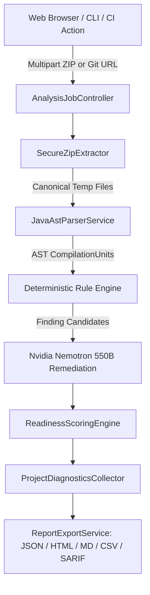

# Codexa Platform Architecture

## Core Architectural Guarantees
1. **Deterministic Execution:** The rule evaluation engine is 100% deterministic and operates on AST syntax graphs.
2. **Zero Ingress Vulnerability:** Zip Slip, Tar bomb, and depth traversal attacks are rejected before disk extraction.
3. **Memory Bounded:** Dynamic headroom check guarantees safe streaming on large (up to 3GB) codebases.
