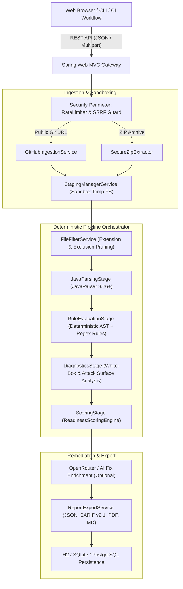

# Codexa Platform Architecture

Codexa is engineered as a high-throughput, deterministic static code review, security auditing, and production readiness platform. It analyzes untrusted codebases without compiling or executing user-provided code, producing explainable vulnerability reports, AST diagnostics, and readiness scores.

---

## 1. High-Level System Architecture

---

## 2. Core Architectural Principles

1. **Zero Dynamic Code Execution**:
   Codexa performs pure static syntactic and semantic analysis. Untrusted source code is never executed, compiled with user build plugins, or loaded into runtime classloaders.
2. **Defensive Ingestion Perimeter**:
   All archive inputs pass through strict streaming validators preventing Zip Slip, zip bombs (decompression ratio caps), symlink traversal, and path depth exhaustion before filesystem write.
3. **Deterministic AST Rules First**:
   All 30+ core rules run deterministically on Abstract Syntax Trees or bounded regex tokenizers without probabilistic variance.
4. **Resilient Scoring with Diminishing Debt Curves**:
   The `ReadinessScoringEngine` applies calibrated asymptotic debt curves to non-critical style and code quality smells, preventing false-positive score degradation while maintaining strict critical security caps.
5. **Memory-Bounded Streaming Architecture**:
   Archives are streamed with fixed 64KB buffers and scanned using parallel directory streams without loading entire multiterabyte monorepos into heap memory.

---

## 3. Pipeline Lifecycle Stages

Each analysis job executes through an asynchronous, stage-tracked state machine:

| Stage | Class | Description |
| :--- | :--- | :--- |
| `EXTRACTING` | `SecureZipExtractor` / `GitHubIngestionService` | Streams repository into a cryptographically randomized sandbox folder (`.staging/{uuid}`). |
| `PARSING` | `JavaParsingStage` | Recursively traverses allowed files, constructs compilation units using JavaParser, and indexes symbols. |
| `EVALUATING` | `RuleEvaluationStage` | Dispatches registered `AnalysisRule` beans concurrently across all staged source files. |
| `DIAGNOSING` | `DiagnosticsStage` | Calculates cyclomatic complexity distribution, method length metrics, and discovers REST/servlet attack surfaces. |
| `SCORING` | `ScoringStage` | Aggregates penalties, evaluates confirmed critical vulnerabilities, and outputs 5-dimensional scores. |
| `COMPLETED` | `AnalysisOrchestrator` | Commits metrics and top findings to the database, cleans staging directories, and publishes SSE events. |

---

## 4. Concurrency & Resource Management

- **Virtual Threads / Thread Pool**: Utilizes configured `ThreadPoolTaskExecutor` optimized for I/O-bound filesystem operations and CPU-bound AST traversals.
- **Resource Cleanup Hook**: All sandboxed directories in `.staging/` are defensively unregistered and deleted upon job completion or failure via try-finally guards.
- **Circuit Breaking**: External AI remediation calls via OpenRouter operate behind strict timeouts (8000ms) with fallback to local rule remediation templates.
