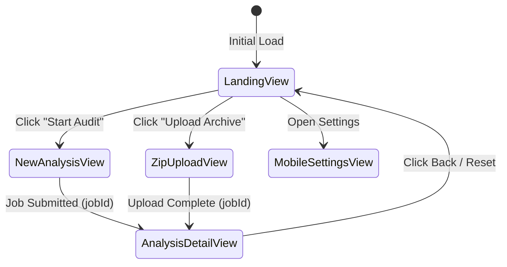

# Codexa Frontend Architecture & State Management Guide

The Codexa web client is a single-page application built with **React 18**, **Vite 5**, **Tailwind CSS**, and **Framer Motion**, delivering a responsive, monochromatic dark-mode user experience for running audits and inspecting security findings.

---

## 1. View State Machine & Navigation

The root controller `App.jsx` manages top-level page transitions via a view state machine:



### Supported View Keys:
- `landing`: Hero section, live radar metrics, feature cards, and recent audits list.
- `new-analysis`: Public GitHub repository submission form with real-time URL validation.
- `zip-upload`: Drag-and-drop archive ingestion supporting up to 3.0 GB ZIP files.
- `analysis`: 5-tab comprehensive analysis report view for a specific `jobId`.
- `settings`: Mobile and desktop configuration panel.

---

## 2. Analysis Dashboard 5-Tab Architecture

When viewing an active or completed audit (`AnalysisDetailView.jsx`), the interface renders five specialized tabs:

1. **Overview Tab**:
   - Executive Production Verdict badge (`REVIEW_COMPLETE`, `GENERALLY_PROMISING`, `NOT_READY`).
   - Radial gauges for 5-axis scores (Security, Quality, Operations, Maintainability, Architecture).
   - High-level triage counters (Critical, High, Medium, Low).
2. **Security Tab**:
   - Filterable table of confirmed vulnerabilities.
   - Expandable code snippets showing masked evidence lines.
   - Remediation drawer with automated fix diffs.
3. **Quality & Maintainability Tab**:
   - Cyclomatic complexity distribution and long method audits.
   - Duplicated code shingles and statement nesting levels.
4. **Architecture & Attack Surface Tab**:
   - REST endpoints and servlet route inventory.
   - Authentication perimeter verification (secured vs open endpoints).
5. **Export & Share Tab**:
   - Multi-format download triggers (JSON schema, SARIF v2.1.0, Markdown summary, PDF).

---

## 3. Real-Time Polling & Lifecycle

```javascript
useEffect(() => {
  if (!activeJobId) return;

  const interval = setInterval(async () => {
    try {
      const data = await client.getAnalysis(activeJobId);
      setJobData(data);
      if (data.status === 'COMPLETED' || data.status === 'FAILED') {
        clearInterval(interval);
      }
    } catch (_) {
      // Resilient silent backoff on transient network drops
    }
  }, 2500);

  return () => clearInterval(interval);
}, [activeJobId]);
```

---

## 4. Design System & Theming Tokens

- **Monochrome Dark Palette**: Background `#000000`, card surfaces `bg-neutral-900/60`, borders `border-neutral-800`.
- **Accent Tokens**: Subtle white highlights, glowing radial gradients, and muted emerald accents for passing verdicts.
- **Typography**: Sora, Plus Jakarta Sans, and JetBrains Mono for code diff views.
