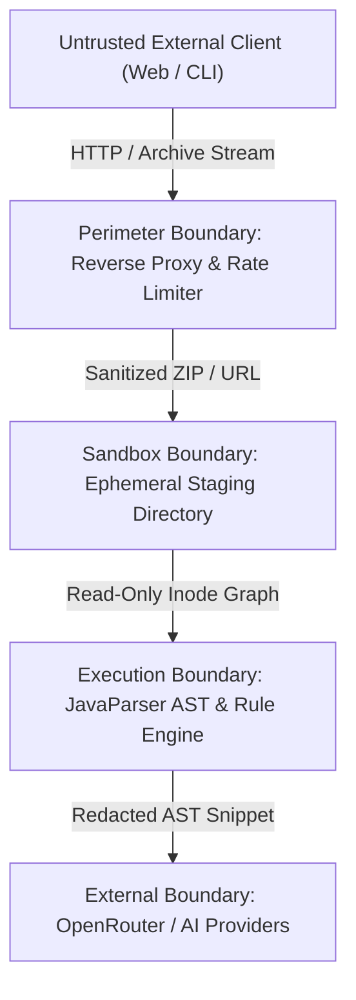

# Codexa Security Threat Model & STRIDE Analysis

Codexa evaluates untrusted third-party software architectures. This document formalizes the threat landscape, trust boundaries, entry surfaces, and structural countermeasures guarding the platform.

---

## 1. System Trust Boundaries & Data Flow

---

## 2. STRIDE Threat Categorization & Mitigations

### 2.1 Spoofing (S)
- **Threat**: Attackers forging client IP addresses to bypass sliding-window rate limit buckets.
- **Countermeasure**: Rate limiting validates remote socket addresses and filters trusted upstream reverse proxy CIDRs in `X-Forwarded-For`.

### 2.2 Tampering (T)
- **Threat**: Uploading archives with path traversal entries (`../../app.jar`) to overwrite host application code.
- **Countermeasure**: `SecureZipExtractor` normalizes all target paths and enforces strict directory boundary confinement.

### 2.3 Repudiation (R)
- **Threat**: Inability to determine who triggered high-volume scans or access audit reports.
- **Countermeasure**: All analysis requests receive immutable UUID tracking (`jobId`) and generate structured JSON audit logs recording timestamps, client identifiers, and file metrics.

### 2.4 Information Disclosure (I)
- **Threat**: Extracting proprietary secrets or private network infrastructure through SSRF or audit reports.
- **Countermeasure**:
  - `SsrfProtection` blocks outbound network resolution to internal IPv4/IPv6 private ranges.
  - `SecretMasker` redacts all credentials, tokens, and keys from persisted findings and reports.

### 2.5 Denial of Service (D)
- **Threat**: Zip bomb amplification attacks, regex catastrophic backtracking (ReDoS), or memory exhaustion.
- **Countermeasure**:
  - Max extracted size (3.0 GB) and file count (50,000) caps.
  - Bounded regex patterns using atomic groups and possessive quantifiers.
  - Fixed-size 64KB streaming buffers.

### 2.6 Elevation of Privilege (E)
- **Threat**: Code execution escape via user-supplied build scripts or malicious payloads.
- **Countermeasure**: Pure static syntactic/semantic analysis. Codexa never invokes `javac`, `mvn`, `npm`, or user build scripts.
